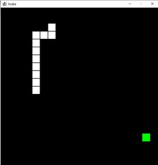
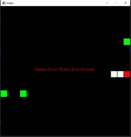

# 1.1 Snake Game Clone Overview

**Overview written by Peter Mitchell.**

## Contents

```
1.1 Snake Game Clone Overview 
1.2 Introduction 
1.3 The Rules of Snake
1.4 Playing the Game: Controls
1.5 High Level Discussion About Implementation
1.6 How the Core Game Works
1.7 Features You Could Add 
```
# 1.2 Introduction

This document will explain the fundamentals of how the Snake game works. 

- ([Youtube Demo](https://youtu.be/EI8MILz4auI))



# 1.3 The Rules of Snake

The rules of snake are a very simple set of conditions and changes in state based on what is happening
in the game. The following list of dot points summarises the rules of Snake.

- The player can control the Snakes movement by making it turn left, right, up, or down.
- The Snake starts with several segments. When moving the segment count is maintained by
    removing the tail segment and moving it forward to the new position of the head.
- The snake can move within the confines of a grid of positions.
- Apples are randomly placed within the world grid.
- Apples are refreshed when all apples have been eaten.
- When the snake moves to a position filled with an apple the apple will be eaten and it
    increases the length of the snake. This is achieved by not removing the tail during movement
    when an apple is eaten.
- When the snake collides either with itself or with a wall the game is over.


# 1.4 Playing the Game: Controls

The controls for playing this game include the following:

- Change the direction of the snake with either WASD or up/down/left/right arrow keys.
- Restart the game with R.
- Quit the game with Escape.

# 1.5 High Level Discussion About Implementation

To implement this example there are only four classes necessary. Those are the following four classes
listed below.

- Position: used to represent a single position on the grid. Used for the individual segment
    positions of the Snake, and the positions of the apples to provide a way to represent them in
    the game’s space with an x and y coordinate.
- Snake: Represents a collection of Positions as segments with methods for updating the
    position of the snake and subsequently collision detection with itself and the walls of the game
    world.
- BoardPanel: The surface to draw the Snake and apples on. It keeps track of the position of
    apples for the Snake to interact with.
- Game: Encapsulates the JFrame creation as the entry point of the game and fills itself with a
    BoardPanel.

 

Above are two examples of the game running. The snake is shown with the white squares for each
segment and the green squares are the apples to collect. The right side shows an example of the game
over screen with red flash on the collision point.


# 1.6 How the Core Game Works

Position is not necessary to really talk about as it just represents an x and y coordinate. So, the main
element to discuss is the Snake itself. The Snake for this game is created with a specified number of
segments and can start with a random direction. This information is given to it from the creation in
BoardPanel. Looking at the methods included for the Snake you will find the following.

- moveSnake(): This takes a translation to move based on the last position of the snake’s head.
    The movement is not completed until a check for collisions is done at the new location. If the
    new location is either outside the bounds of the play area or it is colliding with another
    segment of the snake it will not move and instead update to flash where the collision
    happened. If the move is a valid location it will check for any apples to eat at the location and
    then move by adding the new position to the end of the segments list and either eating an
    apple to become longer or removing the end tail segment.
- paint(): draws the snake by drawing a cube for each segment that it is made up of. If the Snake
    has collided with anything it will also toggle between flashing red to show where the collision
    happened.
- createNewSnake(): creates a snake with the specified number of segments that can branch
    along in any direction from a start point.
- getSnakeLength(): gets the number of segments in the snake.
- hasCollided(): gets the state of the snake to check if it should be paused due to a collision.

The BoardPanel object contains the Snake and keeps track of positions for apples and manages the
game state. Initially when the BoardPanel is created it creates a Snake with a random direction and
three segments with three apples to collect. After this creation step the following methods are used
to give the BoardPanel behaviour.

- update(): Tells the snake to move based on the last movement direction key that was pressed.
    Then if the number of segments has changed a linear difficulty increase is applied by linearly
    reducing the time in ms for each update for each segment in the snake.
- processInput(): checks for WASD and up/down/left/right to set the snake direction with a
    movement vector. Also checks for R to restart and Escape to quit.
- eatApple(): is called by the Snake to check if the position being moved to contains an apple
    from the applePositions array. If there is an apple there it will indicate an apple was eaten and
    remove that apple. If this method is called when there are no apples on the BoardPanel it will
    populate with three new apples randomly on the board using spawnApples().
- spawnApples(): Spawns a specified number of apples anywhere on the BoardPanel. It will clear
    all existing apples, and apples can be in rare cases stacked.
- restart(): Selects a random direction vector pointing up/down/left/right for the snake to start
    moving, then creates the new Snake with 3 segments starting from the middle and moving
    outward in the direction vector. Then uses spawnApples() to place some new apples.
- paint(): Draws the apples, the snake, and if the snake has collided it will show the game over
    text.
- drawApples(): Draws a green rectangle at every position in applePositions.
- drawEndText(): Draws the game over message as text in the middle of the panel.


The last class related to the overall game is the Game class. It exists as the entry point of the game,
and creates the JFrame for the BoardPanel to be contained in. It keeps track of a the timer for update()
calls and has a KeyListener for collecting key events. The methods that make up the Game object
include the following. The methods that were not used (keyReleased/keyTyped) are excluded.

- startGame(): starts the gameLoopTimer to begin calling update() at regular intervals.
- changeTimerFrequency(): is used by the BoardPanel to change the delay of the
    gameLoopTimer for changing the difficulty.
- actionPerformed(): is called when the gameLoopTimer triggers causing an update() to be
    called in BoardPanel.
- keyPressed(): activates when a key is pressed with the KeyListener active. This is passed on to
    the BoardPanel to notify it of the key event so it can do something with the input if it is
    relevant.

# 1.7 Features You Could Add

The implementation of Snake has been provided as a simple implementation of the game. There are
some things that could be added to improve the base game, and some that could be added to increase
the feature set.

- Fix the bug with “preventDoubleBacks” in BoardPanel: The bug occurs when
    preventDoubleBacks is set to true. This should prevent the player from doubling back on
    themselves. The bug occurs when the player swaps rapidly between directions. If they were
    travelling left, then pressed up, and then right within the duration of a single update it will still
    double back.
- Modify the rules of the game so you can exit on one side of the board and enter from the
    opposite side on the same row or column.
- Change the difficulty from increasing linearly to some other approach.
- Change how the apples spawn. This could include the quantities, when they spawn, they could
    have a duration before they disappear themselves, or perhaps make it so the spawned apples
    can not appear under the snake with a smarter random selection.
- Add temporary obstacles that can appear in the same way apples do. These could be bombs,
    walls, or perhaps the opposite with powers to collect.
- Add a high score table that scores perhaps based on how many segments were achieved
    before the game ended. This could be extended by having a list of people with names and
    saving the scores to a file.
- Create your own rules to change the game in some unique way.


